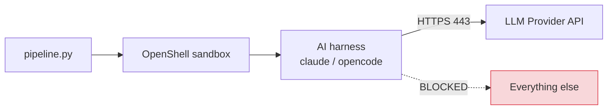

# Sandboxing

AI skills run inside an OpenShell sandbox by default. This provides network-level isolation so that AI agents can only reach the LLM provider API, preventing data exfiltration or unintended network access.

## How it works



The pipeline generates a dynamic OpenShell policy based on the model's provider, creates the sandbox, uploads credentials and config, runs the AI command inside it, downloads output, and tears it down.

## Sandbox lifecycle

### For adversarial-reviewing agents

Each FSM agent (SEC, PERF, QUAL, CORR, ARCH) gets its own sandbox:

1. **Stage**: GCP credentials, OpenCode config, and the dispatch directory are copied to a secure temp dir (`tempfile.mkdtemp`, mode 0o700)
2. **Upload**: The staging dir is uploaded to the sandbox via `--upload`
3. **Setup**: Inside the sandbox, env vars are set and OpenCode config is copied to `$HOME/.config/opencode/`
4. **Run**: The agent reads instructions, reviews code, writes findings
5. **Download**: `output.md` is downloaded back to the host dispatch directory
6. **Cleanup**: Sandbox is deleted, staging dir is removed

### For semantic-scan

The semantic-scan skill uses a simpler flow (single sandbox, no dispatch):

1. Policy generated, credentials staged
2. Sandbox created with `--no-keep`
3. AI command runs, sandbox auto-deletes

## OpenShell policy

The network policy allows outbound HTTPS only to the LLM provider endpoint:

```yaml
version: 1
filesystem_policy:
  include_workdir: true
  read_only: [/usr, /lib, /proc, /dev/urandom, /etc]
  read_write: [/tmp, /dev/null]
network_policies:
  llm_api:
    name: llm-api
    endpoints:
      - host: us-east5-aiplatform.googleapis.com  # Dynamic per provider
        port: 443
        protocol: rest
        enforcement: enforce
        access: full
        request_body_credential_rewrite: true
    binaries:
      - path: /usr/local/bin/claude
      - path: /usr/local/bin/opencode
      - path: /usr/bin/node
      - path: /usr/bin/curl
  gcp_auth:
    name: gcp-auth
    endpoints:
      - host: oauth2.googleapis.com
        port: 443
        access: full
      - host: accounts.google.com
        port: 443
        access: full
```

### Dynamic provider mapping

The `host` field is set dynamically based on the `--model` flag:

| Provider | Host |
|---|---|
| Anthropic | `api.anthropic.com` |
| OpenAI | `api.openai.com` |
| Google | `generativelanguage.googleapis.com` |
| Google Vertex (Gemini) | `us-east5-aiplatform.googleapis.com` |
| Google Vertex (Claude) | `us-east5-aiplatform.googleapis.com` |
| Custom | `$SECURITY_AUDIT_PROVIDER_HOST` |

## Credential handling

### GCP Application Default Credentials

When `~/.config/gcloud/application_default_credentials.json` exists, it is uploaded to the sandbox and `GOOGLE_APPLICATION_CREDENTIALS` is set inside the container.

### OpenCode provider config

When `~/.config/opencode/config.json` exists, it is uploaded and copied to the sandbox's `$HOME/.config/opencode/` so OpenCode can discover the provider.

### API keys

`ANTHROPIC_API_KEY` and other sensitive values are NOT passed via shell command strings. They are passed through environment variables to prevent exposure in `ps aux` process listings.

## Fail-closed behavior

1. If OpenShell is not installed, the pipeline attempts auto-install via `uv` or `pip3`
2. If the gateway is not connected, the pipeline logs an error and refuses to run AI skills
3. The pipeline does **not** fall back to unsandboxed execution unless `--no-sandbox` is explicitly passed

!!! warning "Explicit opt-out required"
    The pipeline never silently degrades to unsandboxed mode. Pass `--no-sandbox` explicitly if needed.

## Running without sandbox

```bash
python3 pipeline.py org/repo --no-sandbox
```

!!! tip "When to use --no-sandbox"
    Local development, CI without OpenShell, or when scanning public repos where exfiltration risk is low.

## Verifying sandbox status

```bash
openshell status
# Expected: Connected

# If not running:
brew services start openshell
```
