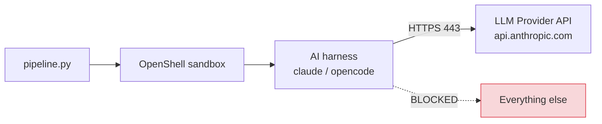

# Sandboxing

AI skills run inside an OpenShell sandbox by default. This provides network-level isolation so that AI agents can only reach the LLM provider API, preventing data exfiltration or unintended network access.

## How it works



The pipeline generates a dynamic OpenShell policy based on the model's provider, creates the sandbox, runs the AI command inside it, and tears it down when done.

## OpenShell policy

The network policy allows outbound HTTPS only to the LLM provider endpoint:

```yaml
version: 1
filesystem_policy:
  include_workdir: true
  read_only:
    - /usr
    - /lib
    - /proc
    - /dev/urandom
    - /etc
  read_write:
    - /tmp
    - /dev/null
network_policies:
  llm_api:
    name: llm-api
    endpoints:
      - host: api.anthropic.com    # Dynamic per provider
        port: 443
        protocol: rest
        enforcement: enforce
        access: full
        request_body_credential_rewrite: true
    binaries:
      - path: /usr/local/bin/claude
      - path: /usr/local/bin/opencode
      - path: /usr/bin/node
      - path: /usr/bin/curl
```

### Dynamic provider mapping

The `host` field is set dynamically based on the `--model` flag:

| Provider | Host |
|---|---|
| Anthropic | `api.anthropic.com` |
| OpenAI | `api.openai.com` |
| Google | `generativelanguage.googleapis.com` |
| Custom | `$SECURITY_AUDIT_PROVIDER_HOST` |

### Filesystem policy

| Access | Paths | Purpose |
|---|---|---|
| Read-write | Working directory, `/tmp`, `/dev/null` | Skill needs to write outputs |
| Read-only | `/usr`, `/lib`, `/proc`, `/dev/urandom`, `/etc` | System libraries, random, config |

## Fail-closed behavior

The sandbox enforces a fail-closed model:

1. If OpenShell is not installed, the pipeline attempts to install it automatically via `uv` or `pip3`.
2. If OpenShell is installed but the gateway is not connected, the pipeline logs an error and refuses to run AI skills.
3. The pipeline does **not** fall back to unsandboxed execution unless `--no-sandbox` is explicitly passed.

```
[14:22:05] [ERROR] OpenShell not available. Use --no-sandbox to run without isolation.
```

!!! warning "Explicit opt-out required"
    The pipeline never silently degrades to unsandboxed mode. You must explicitly pass `--no-sandbox` if you want to run without isolation. This is a deliberate security design choice.

## Sandbox lifecycle

Each AI skill gets its own ephemeral sandbox:

```bash
# Create sandbox with auto-cleanup (--no-keep)
openshell sandbox create \
  --name security-audit-adversarial-reviewing-1717500000 \
  --no-keep \
  --auto-providers \
  --policy /tmp/openshell-policy-abc123.yaml \
  -- claude -p "Run this skill..."
```

- `--no-keep`: Sandbox is automatically deleted after the command exits
- `--auto-providers`: OpenShell injects API credentials automatically
- The policy file is a temp file that gets cleaned up after use
- Each sandbox has a unique name with the skill name and timestamp

### Timeout handling

AI skills have a 1-hour timeout. If the timeout expires:

1. The sandbox process is killed
2. The sandbox is explicitly deleted via `openshell sandbox delete`
3. The skill is marked as failed but the pipeline continues

## Running without sandbox

For local development or environments without OpenShell:

```bash
python3 pipeline.py org/repo --no-sandbox
```

This runs AI skills as direct subprocesses without network isolation. The AI agents will have full network access.

!!! tip "When to use --no-sandbox"
    Local development, CI environments without OpenShell, or when scanning public repositories where the risk of data exfiltration is low.

## Verifying sandbox status

Check if OpenShell is ready:

```bash
openshell status
# Expected: Connected

# If not running, start the gateway:
brew services start openshell
```

The pipeline checks connectivity before each AI skill invocation and logs the status:

```
[14:22:03] [INFO] Step 3: AI skills
[14:22:03] [INFO]   Invoking adversarial-reviewing...
```

If the gateway is down, you'll see:

```
[14:22:03] [WARN]   OpenShell installed but gateway not connected
[14:22:03] [ERROR]  OpenShell not available. Use --no-sandbox to run without isolation.
```
