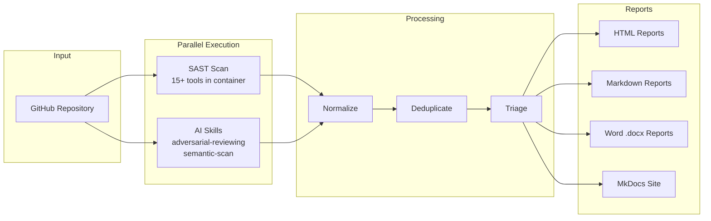

# RHOAI Security Audit

A deterministic security audit pipeline that combines 15+ SAST tools with AI-powered code review to produce comprehensive, cross-correlated security reports.

!!! warning "CONFIDENTIAL"
    Reports generated by this tool carry a **CONFIDENTIAL** banner. They contain detailed vulnerability information including file paths, code snippets, and remediation guidance. Treat all output as internal-only unless explicitly cleared for distribution.

## Architecture

## What it does

The pipeline clones a target repository, runs static analysis tools inside a container, spawns isolated AI agents for semantic code review, then cross-correlates all findings into a single triaged output. Every step is orchestrated by `pipeline.py`, a deterministic Python script. No LLM is in the orchestration loop.

## Key capabilities

| Capability | Details |
|---|---|
| **SAST coverage** | 15+ tools: semgrep, gitleaks, trufflehog, trivy, grype, osv-scanner, kube-linter, hadolint, shellcheck, actionlint, zizmor, govulncheck, gosec, yamllint, pip-audit |
| **AI review** | 5-agent adversarial review (SEC, PERF, QUAL, CORR, ARCH) with challenge rounds and red team debate. 3-agent semantic scan (repo-analyst, security-scanner, post-scan). |
| **Cross-correlation** | Findings matched across SAST and AI outputs. Corroborated findings get boosted confidence. Noise paths (test/, examples/) get demoted. |
| **Report formats** | 7 output formats: self-contained HTML, must-fix HTML, MkDocs site, Word .docx (full + must-fix), executive markdown, must-fix markdown |
| **Sandboxing** | AI skills run inside OpenShell with network policy restricting access to the LLM provider API only |
| **LLM-agnostic** | Works with Claude Code and OpenCode. Supports Anthropic, OpenAI, and Google providers via `--model` flag. |

## Quick links

- [Installation](getting-started/installation.md): Get the tools set up
- [Quick Start](getting-started/quickstart.md): Run your first scan
- [Pipeline Overview](pipeline/overview.md): How the pipeline works end-to-end
- [SAST Tools](pipeline/sast-tools.md): What each tool detects
- [AI Skills](pipeline/ai-skills.md): How the AI agents review code
- [Report Formats](reports/formats.md): All 7 output formats
- [OpenCode Setup](configuration/opencode.md): Configure for OpenCode
- [Sandboxing](configuration/sandboxing.md): Network isolation for AI skills
