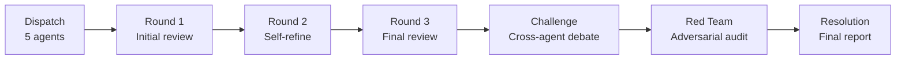

# AI Skills

The pipeline invokes two AI skills that perform semantic code review. Unlike SAST tools that match patterns, these skills reason about code logic, architecture, and context. They catch classes of bugs that static analysis fundamentally cannot: logic errors, race conditions, authorization bypasses that depend on business logic, and architectural concerns.

## Adversarial Reviewing

The [adversarial-reviewing](https://github.com/ugiordan/adversarial-reviewing) skill runs a multi-agent code review with 5 specialist agents, a challenge round, and a red team audit. It's orchestrated by a deterministic FSM (finite state machine), not by an LLM.

### Agent roster

| Agent | Focus | What it looks for |
|---|---|---|
| **SEC** | Security | Authentication bypasses, injection vectors, privilege escalation, secrets handling, TLS configuration |
| **PERF** | Performance | Unbounded allocations, N+1 queries, missing pagination, goroutine leaks, blocking calls in hot paths |
| **QUAL** | Code Quality | Error handling gaps, dead code, inconsistent APIs, missing validation, test coverage holes |
| **CORR** | Correctness | Race conditions, off-by-one errors, nil pointer dereferences, incorrect state transitions, data loss paths |
| **ARCH** | Architecture | Layering violations, circular dependencies, missing abstractions, coupling, API surface concerns |

### Review phases



1. **Dispatch**: Each agent receives the repository content and its specialist prompt
2. **Iterations (3 rounds)**: Each agent reviews the code, then reviews its own output for false positives and missed issues
3. **Challenge round**: Agents challenge each other's findings. SEC might dispute a PERF finding if it introduces a security regression, and vice versa.
4. **Red team audit**: A red team agent adversarially examines all findings for plausibility, severity accuracy, and exploitability
5. **Resolution**: Final findings consolidated into `REPORT.md`

### Output format

Adversarial-reviewing findings use this format:

```
Finding ID: SEC-001
Title: Missing CSRF token validation on state-changing endpoint
Severity: High
Confidence: High
File: pkg/api/handlers.go
Lines: 142-158
Evidence: The POST /api/settings handler modifies server configuration
  but does not validate Origin or CSRF tokens...
Impact: An attacker could modify server settings via a cross-site
  request if the victim is authenticated.
Recommended fix: Add CSRF middleware to all state-changing routes.
```

## Semantic Scan

The [rhoai-security-scanner](https://github.com/ugiordan/rhoai-security-scanner) skill performs a 3-agent semantic analysis focused on security patterns specific to Kubernetes operators and cloud-native applications.

### Agent pipeline

| Agent | Role |
|---|---|
| **repo-analyst** | Inventories the repository: languages, frameworks, entry points, deployment model, dependency graph |
| **security-scanner** | Deep security analysis using the repo inventory as context. Focuses on data flow, trust boundaries, and privilege boundaries. |
| **post-scan** | Consolidates findings, removes duplicates, assigns severity and confidence scores |

### Output format

Semantic-scan outputs a `security-report.md` with findings in this format:

```
### 1. Insecure TLS Configuration in gRPC Client

**Severity:** HIGH
**Confidence:** 0.85
**File:** `pkg/client/grpc.go`
**Category:** crypto

**Issue Description**
The gRPC client is configured with `grpc.WithInsecure()` which disables
TLS verification entirely...

**Remediation**
Replace `grpc.WithInsecure()` with `grpc.WithTransportCredentials()`
using a proper TLS configuration...
```

## Architecture context integration

Both AI skills benefit from architecture context provided by the `--arch-context` flag. When architecture-analyzer output is available, agents receive:

- Component dependency graph
- Trust boundary definitions
- API surface inventory
- Deployment topology

This context significantly reduces false positives because agents understand which components are internal vs. external-facing, which have elevated privileges, and how data flows through the system.

```bash
# Provide local architecture context
python3 pipeline.py org/repo --arch-context /tmp/arch-output

# Download from a GitHub repo's artifacts
python3 pipeline.py org/repo --arch-context ugiordan/architecture-analyzer
```

See [Architecture Context](../configuration/arch-context.md) for details.

## How AI skills are invoked

Each AI skill runs as an isolated subprocess:

```python
# Claude Code
["claude", "--add-dir", plugin_dir, "-p", prompt,
 "--allowedTools", "Bash,Read,Write,Grep,Glob,Skill,Agent",
 "--max-turns", "100"]

# OpenCode
["opencode", "run", "--model", model, "--max-turns", "100", prompt]
```

When sandboxing is enabled, the command is wrapped in an OpenShell sandbox:

```bash
openshell sandbox create \
  --name security-audit-adversarial-reviewing-1717500000 \
  --no-keep \
  --auto-providers \
  --policy /tmp/openshell-policy-xyz.yaml \
  -- claude -p "Run this skill..."
```

The network policy restricts the subprocess to only reach the LLM provider API (e.g., `api.anthropic.com:443`). See [Sandboxing](../configuration/sandboxing.md) for details.
