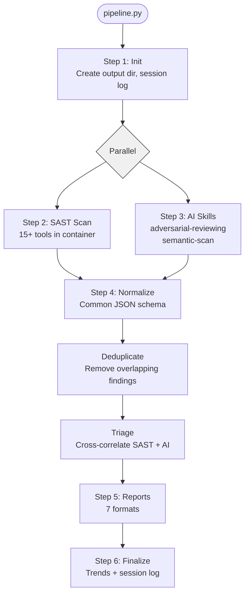

# Pipeline Overview

The security audit pipeline is a deterministic Python orchestrator (`pipeline.py`) that removes the LLM from the control loop. Every step is a Python function that shells out to tools or spawns isolated AI sessions. The pipeline decides what runs and in what order. AI agents only perform analysis, never orchestration.

## Pipeline flow



## Steps in detail

### Step 1: Init

Creates the output directory structure under `~/.security-audit/output/<repo-name>/<timestamp>/` and initializes a session log (`session-log.json`) that tracks timing and status for each pipeline stage. Override the base path with `SECURITY_AUDIT_OUTPUT_DIR`.

### Step 2: SAST scan

Runs `scan_container.sh`, which:

1. Clones the target repository (shallow clone, `--depth 1`)
2. Runs each SAST tool with a 10-minute timeout per tool
3. Writes raw JSON outputs to `<output-dir>/raw/`
4. Produces `security-summary.json` with finding counts per tool and `commit-info.json` with the scanned commit SHA

The SAST scan runs inside a container built from `Dockerfile.scanner` that has all tools pre-installed. If no container runtime is available, the pipeline falls back to running tools directly if they're on PATH.

### Step 3: AI skills

Spawns two isolated AI sessions in sequence:

1. **adversarial-reviewing**: 5 specialist agents (SEC, PERF, QUAL, CORR, ARCH) run 3 iterations of review, followed by a challenge round and red team audit. Output is an `REPORT.md` in the FSM cache.
2. **semantic-scan**: 3 agents (repo-analyst, security-scanner, post-scan) perform semantic analysis. Output goes to a `.security-scan/` workspace.

Each AI session is an isolated subprocess (Claude Code or OpenCode). When sandboxing is enabled, the subprocess runs inside an OpenShell sandbox with network access restricted to the LLM provider API.

!!! info "SAST and AI run in parallel"
    When AI skills are enabled (the default), Steps 2 and 3 execute concurrently using a `ThreadPoolExecutor`. This significantly reduces total scan time since SAST tools and AI agents don't depend on each other.

### Step 4: Normalize, deduplicate, triage

Three scripts run in sequence:

1. **normalize.py**: Reads raw tool outputs from `raw/` and converts each finding to the [normalized schema](../pipeline/sast-tools.md). Each tool has a dedicated parser. Findings get stable IDs (e.g., `SEM-001`, `TRV-023`, `GLK-005`).
2. **dedup.py**: Removes duplicate findings based on file path + line range + rule ID overlap. Tools like trivy and grype often flag the same CVE.
3. **triage.py**: Cross-correlates SAST findings with AI findings. Produces three categories:
    - **Corroborated**: Found by both SAST tool and AI agent. Highest confidence.
    - **AI-only**: Logic bugs, design issues, or context-dependent problems that SAST tools can't detect.
    - **SAST-only**: Standard tool findings without AI confirmation.

### Step 5: Reports

Seven report formats are generated from the triaged findings:

| Report | Script | Output |
|---|---|---|
| Full HTML | `report_standalone.py` | `security-report.html` |
| Must-fix HTML | `report_mustfix.py --html` | `must-fix-report.html` |
| MkDocs site | `report_html.py` | `report-site/` |
| Full Word | `report_docx.py` | `security-report.docx` |
| Must-fix Word | `report_docx.py --must-fix` | `must-fix-report.docx` |
| Executive MD | `report.py` | `executive-report.md` |
| Must-fix MD | `report_mustfix.py` | `must-fix-report.md` |

### Step 6: Finalize

Updates `~/.security-audit/security-trends.json` with the scan results for historical tracking. Finalizes the session log with total duration and exit status.

## Harness detection

The pipeline auto-detects whether it's running under Claude Code or OpenCode:

```python
# Priority order:
# 1. SECURITY_AUDIT_HARNESS env var (explicit override)
# 2. CLAUDE_SKILL_DIR env var (set by Claude Code)
# 3. claude binary on PATH
# 4. opencode binary on PATH
```

Claude Code is preferred when both are installed (backward compatibility). Override with:

```bash
export SECURITY_AUDIT_HARNESS=opencode
```

## Reports-only mode

Regenerate reports from an existing scan without re-running SAST or AI:

```bash
python3 pipeline.py opendatahub-io/kube-auth-proxy --reports-only
# Or specify a scan directory:
python3 pipeline.py opendatahub-io/kube-auth-proxy --reports-only --scan-dir ~/.security-audit/output/kube-auth-proxy/2026-06-04-142201
```

This re-runs Steps 4 and 5 (normalize, dedup, triage, reports) using existing raw data.
