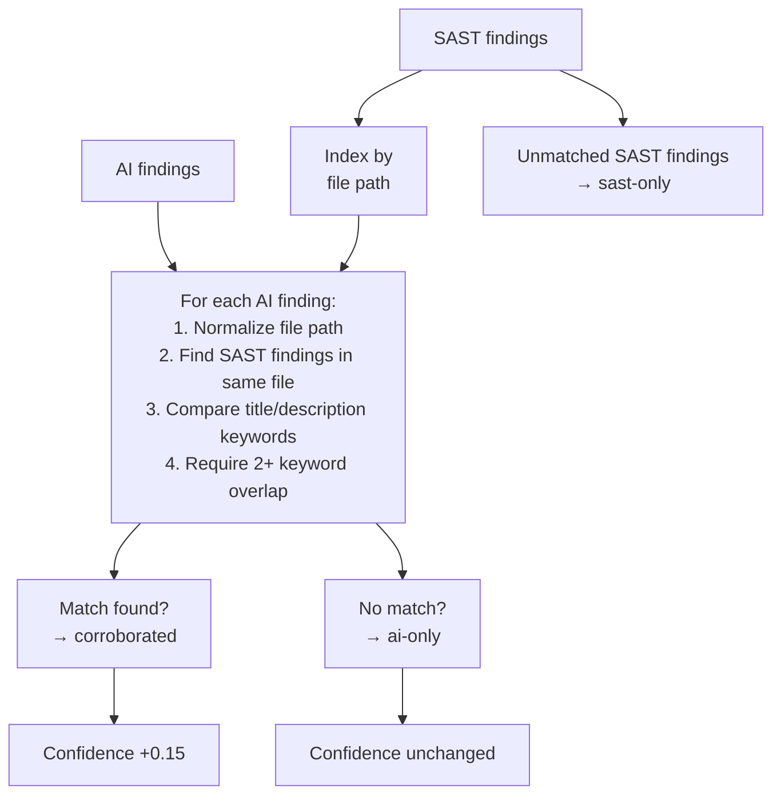

# Triage System

The triage system (`triage.py`) is the core value proposition of the pipeline. It cross-correlates findings from 15+ SAST tools with AI review outputs, labels each finding based on corroboration, demotes noise, and computes confidence scores.

## Triage categories

Every finding gets one of three triage labels:

| Label | Badge | Meaning | Confidence effect |
|---|---|---|---|
| **Corroborated** | `CORR` (green) | Found by both a SAST tool and an AI agent | +0.15 boost (capped at 1.0) |
| **AI-only** | `AI` (blue) | Found by AI agent only. Typically logic bugs, design issues, or context-dependent problems. | Base confidence preserved |
| **SAST-only** | (none) | Found by SAST tool only, no AI confirmation | Base confidence preserved |

## Cross-correlation algorithm



### File path matching

File paths are normalized by stripping common prefixes (`/tmp/scan-repo/`, repo root segments) and matching on the relative path suffix. This handles the fact that SAST tools see paths inside the scanner container while AI agents see paths from the cloned repo.

```python
def _file_key(filepath):
    # Normalize: strip prefixes, keep last 3 segments
    parts = filepath.replace("\\", "/").strip().split("/")
    for i, p in enumerate(parts):
        if p in ("repo", "repos", "cmd", "pkg", "internal", "api"):
            return "/".join(parts[i:])
    return "/".join(parts[-3:]) if len(parts) > 3 else "/".join(parts)
```

### Keyword matching

After file path matching, the triage system extracts keywords from finding titles and descriptions, then looks for overlap:

```python
def _title_keywords(title):
    stopwords = {"the", "a", "an", "in", "of", "for", "to", "is", ...}
    words = set(re.findall(r'[a-zA-Z]{3,}', title.lower())) - stopwords
    return words
```

A match requires at least 2 overlapping keywords between the SAST finding and AI finding. The match with the highest keyword overlap is selected.

## Noise demotion

Findings in non-production paths are automatically demoted to `low` severity:

| Path pattern | Reason |
|---|---|
| `scripts/templates/` | Template/scaffold code |
| `examples/` | Example/demo code |
| `testdata/` | Test fixtures |
| `test/` | Test code |
| `demos/` | Demo applications |

When a finding is demoted, the original severity is preserved in `triage.demoted_from` and the reason in `triage.demote_reason`:

```json
{
  "severity": "low",
  "triage": {
    "status": "sast-only",
    "demoted_from": "high",
    "demote_reason": "Finding in test/ (non-production code)"
  }
}
```

## Confidence scoring

After cross-correlation and noise demotion, confidence scores are adjusted:

| Triage status | Confidence adjustment |
|---|---|
| Corroborated | `min(base + 0.15, 1.0)` |
| AI-only | Base confidence (from AI agent) |
| SAST-only | Base confidence (from tool) |
| Demoted | `max(base - 0.20, 0.3)` |

See [Confidence Scoring](../reports/confidence-scoring.md) for how these scores are displayed in reports.

## Output format

The triage step outputs `triaged-findings.json`, an array of findings sorted by severity (descending), confidence (descending), and file path:

```json
[
  {
    "id": "SEM-003",
    "source": "semgrep",
    "origin": "sast",
    "severity": "critical",
    "confidence": 0.95,
    "file": "pkg/auth/token.go",
    "line_start": 87,
    "line_end": 92,
    "title": "Hardcoded JWT signing key",
    "triage": {
      "status": "corroborated",
      "corroborated_by_ai": "SEC-002",
      "match_score": 4
    }
  },
  {
    "id": "SEC-007",
    "source": "adversarial-review",
    "origin": "ai",
    "severity": "high",
    "confidence": 0.82,
    "file": "pkg/api/handlers.go",
    "title": "Missing rate limiting on authentication endpoint",
    "triage": {
      "status": "ai-only"
    }
  }
]
```

Stderr outputs a summary:

```json
{"total": 47, "sast_only": 30, "ai_only": 9, "corroborated": 8, "demoted": 3}
```
